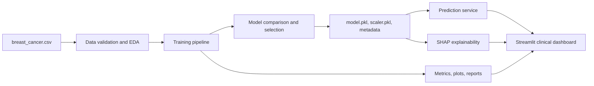

# Breast Cancer Prediction and Clinical Decision Support System

Production-ready healthcare AI MVP for breast cancer malignancy prediction using the `breast_cancer.csv` dataset.

## Project Overview

This application provides an end-to-end clinical decision support workflow:

- Data validation, missing value analysis, duplicate detection, outlier analysis, correlation analysis, class imbalance review, and feature importance analysis.
- Automated model training and comparison across Logistic Regression, Random Forest, Support Vector Machine, XGBoost, LightGBM, and CatBoost when all optional libraries are installed.
- Hyperparameter tuning with `GridSearchCV` and `RandomizedSearchCV`.
- Evaluation with accuracy, precision, recall, F1 score, ROC-AUC, confusion matrix, ROC curve, and precision-recall curve.
- SHAP explainability for global and patient-level model interpretation.
- Multi-page Streamlit healthcare dashboard.
- Docker, Streamlit Cloud, AWS EC2, Azure App Service, and test-ready packaging.

## Architecture



## Repository Structure

```text
BreastCancerAI/
├── data/
│   └── breast_cancer.csv
├── notebooks/
│   ├── 01_EDA.ipynb
│   ├── 02_Model_Training.ipynb
│   └── 03_Model_Comparison.ipynb
├── src/
│   ├── preprocessing.py
│   ├── feature_engineering.py
│   ├── train.py
│   ├── evaluate.py
│   ├── predict.py
│   ├── explainability.py
│   └── utils.py
├── models/
├── reports/
├── app/
│   ├── Home.py
│   └── pages/
├── tests/
├── config.yaml
├── requirements.txt
├── environment.yml
├── Dockerfile
├── docker-compose.yml
└── README.md
```

## Installation

Use Python 3.11 for the broadest compatibility with XGBoost, LightGBM, CatBoost, SHAP, and Streamlit.

```bash
cd BreastCancerAI
python -m venv .venv
.venv\Scripts\activate
pip install --upgrade pip
pip install -r requirements.txt
```

Conda option:

```bash
cd BreastCancerAI
conda env create -f environment.yml
conda activate breast-cancer-ai
```

## Training

```bash
cd BreastCancerAI
python -m src.train --data data/breast_cancer.csv
```

Training produces:

- `models/model.pkl`
- `models/scaler.pkl`
- `models/model_metadata.json`
- `models/feature_names.json`
- `reports/metrics.json`
- `reports/model_comparison.csv`
- `reports/feature_importance.csv`
- `reports/data_validation_report.json`
- evaluation and analytics plots in `reports/`

## Evaluation

```bash
cd BreastCancerAI
python -m src.evaluate --data data/breast_cancer.csv
```

## Prediction CLI

```bash
cd BreastCancerAI
python -m src.predict --input-json "{\"radius_mean\":17.99,\"texture_mean\":10.38,\"perimeter_mean\":122.8,\"area_mean\":1001,\"smoothness_mean\":0.1184,\"compactness_mean\":0.2776,\"concavity_mean\":0.3001,\"concave points_mean\":0.1471,\"symmetry_mean\":0.2419,\"fractal_dimension_mean\":0.07871,\"radius_se\":1.095,\"texture_se\":0.9053,\"perimeter_se\":8.589,\"area_se\":153.4,\"smoothness_se\":0.006399,\"compactness_se\":0.04904,\"concavity_se\":0.05373,\"concave points_se\":0.01587,\"symmetry_se\":0.03003,\"fractal_dimension_se\":0.006193,\"radius_worst\":25.38,\"texture_worst\":17.33,\"perimeter_worst\":184.6,\"area_worst\":2019,\"smoothness_worst\":0.1622,\"compactness_worst\":0.6656,\"concavity_worst\":0.7119,\"concave points_worst\":0.2654,\"symmetry_worst\":0.4601,\"fractal_dimension_worst\":0.1189}"
```

## Streamlit Application

```bash
cd BreastCancerAI
streamlit run app/Home.py
```

Pages:

- Home
- Prediction
- Analytics
- Explainability
- Model Performance
- About

## Explainability

```bash
cd BreastCancerAI
python -m src.explainability --data data/breast_cancer.csv
```

Generated artifacts:

- `reports/shap_summary.png`
- `reports/shap_waterfall.png`
- `reports/shap_feature_importance.png`

## Testing

```bash
cd BreastCancerAI
python -m unittest discover -s tests
```

or:

```bash
pytest
```

## Docker Deployment

Build and run:

```bash
cd BreastCancerAI
docker build -t breast-cancer-ai .
docker run -p 8501:8501 breast-cancer-ai
```

Docker Compose:

```bash
cd BreastCancerAI
docker compose up --build
```

Open:

```text
http://localhost:8501
```

## Streamlit Cloud Deployment

1. Push the project to GitHub.
2. In Streamlit Cloud, create a new app from the repository.
3. Set the main file path to `app/Home.py`.
4. Ensure `requirements.txt` is present.
5. Add trained artifacts under `models/` and `reports/`, or run `python -m src.train --data data/breast_cancer.csv` before deployment as part of the build workflow.

## AWS EC2 Deployment

```bash
sudo apt-get update
sudo apt-get install -y python3.11 python3.11-venv git
git clone <repository-url>
cd BreastCancerAI
python3.11 -m venv .venv
source .venv/bin/activate
pip install --upgrade pip
pip install -r requirements.txt
python -m src.train --data data/breast_cancer.csv
streamlit run app/Home.py --server.address=0.0.0.0 --server.port=8501
```

Security group:

- Allow inbound TCP 8501 from approved IP ranges.
- Use HTTPS behind an Application Load Balancer or reverse proxy for production.

## Azure App Service Deployment

1. Create an Azure App Service using a Python 3.11 runtime.
2. Deploy this repository.
3. Set startup command:

```bash
streamlit run app/Home.py --server.address=0.0.0.0 --server.port=8000
```

4. Configure `PYTHONPATH=/home/site/wwwroot`.
5. Train artifacts during CI/CD or include approved artifacts with the deployment.

## Screenshots and Reports

Generated report images can be used as screenshots for investor or clinical demos:

- `reports/class_distribution.png`
- `reports/correlation_heatmap.png`
- `reports/feature_importance.png`
- `reports/model_comparison.png`
- `reports/confusion_matrix.png`
- `reports/roc_curve.png`
- `reports/precision_recall_curve.png`
- `reports/shap_summary.png`
- `reports/shap_waterfall.png`
- `reports/shap_feature_importance.png`

## Clinical Governance

This application is a clinical decision support MVP, not a standalone diagnostic medical device. Real clinical deployment requires external validation, quality management, privacy and security review, clinical safety assessment, bias and fairness evaluation, monitoring, model change control, audit logging, and regulatory review.

## Future Improvements

- External validation on multi-site clinical datasets.
- DICOM and pathology image model integration.
- FHIR/EHR integration.
- Model registry and drift monitoring.
- Role-based access control.
- Audit logging and clinical feedback loop.
- CI/CD pipeline with automated model quality gates.

